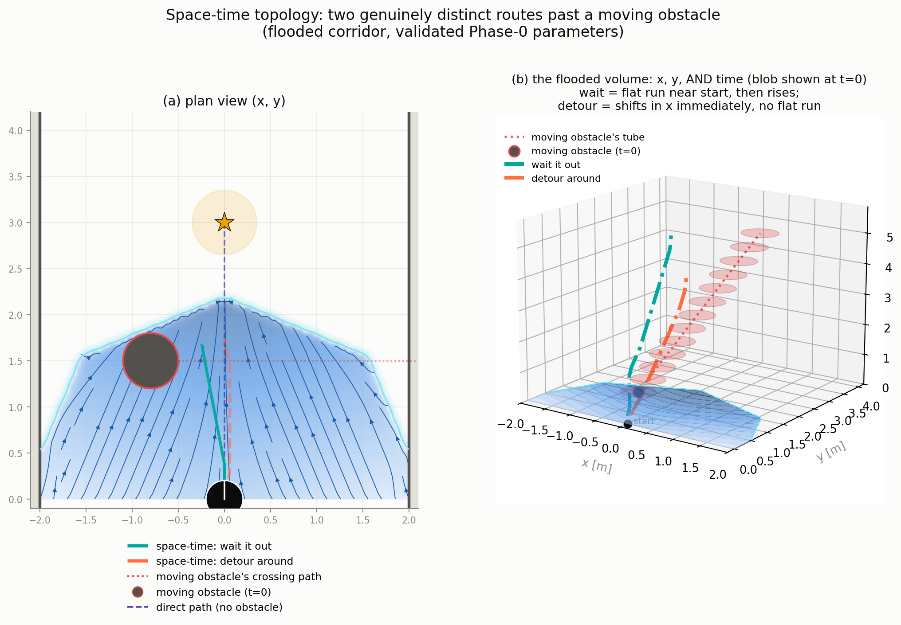
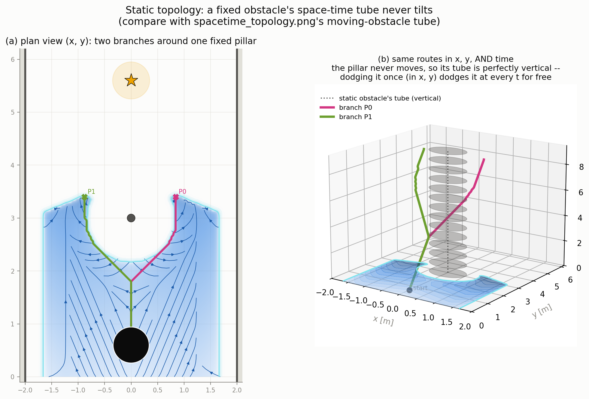
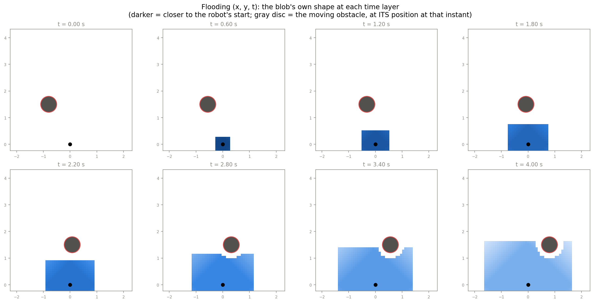
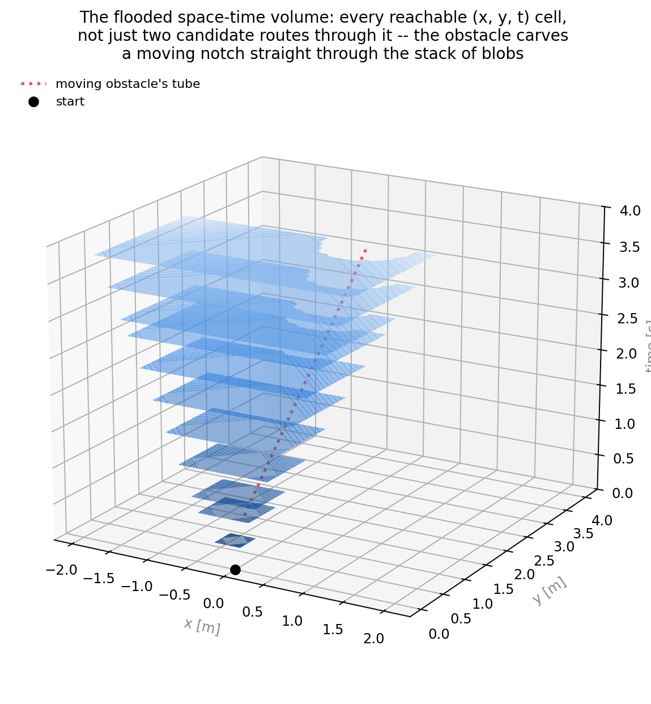

# TG-MPPI sandbox

*(Renamed from "Amoeba MPPI" per advisor feedback -- the method is
bio-inspired but its foundations are geometric/mathematical, not a model of
literal amoeba behavior. The codebase, ROS package, and file names below
still use `amoeba`/`Amoeba` internally; that rename is deliberately
deferred, separate work -- see `docs/amoeba_mathematics_guide.tex` for the
first fully renamed document.)*

NumPy prototype for a topology-informed, multimodal MPPI controller. Sandbox
validation has progressed through V7.2, and the current work is the phased
Nav2 C++ port. The port has progressed through observer-only integration to
Phase 3: a finite geodesic flood body selects up to three topological branches
(pseudopods) from its boundary, turns them into time-varying ancillary controls, and assigns a promise-weighted part
of the MPPI sample batch to those distinct modes. Ordinary Nav2 MPPI samples
remain in the batch as the protected fallback; the flow critic is still held
off while ancillary sampling is validated independently.

This directory remains the research and evidence workspace. The ROS 2 plugin
lives separately at `~/robohouse_ws/src/nav2_amoeba_mppi_controller`.

## Run it

Requirements: Python 3, NumPy, and SciPy. PyQtGraph plus a Qt binding is used
for fast live animation; Matplotlib remains required for static PNG figures
and the legacy live renderer.

An independent, optional PyTorch numerical port lives in `torch_port/`. It
does not replace or import the NumPy controller. Use `environment-torch.yml`
to reproduce its isolated Conda environment; see `torch_port/README.md` for
parity tests and CPU/CUDA benchmarks.

## V6.1 dynamic-obstacle ablation

Run a quick paired prediction-off/on check without rendering:

```bash
python3 -m experiments.v61_ablation --worlds 42,48 --seeds 1 --samples 256 \
  --max-steps 300 --jobs 2
```

Run the declared 10-world, two-seed experiment with the default 1024 samples
and 56-step horizon:

```bash
python3 -m experiments.v61_ablation --jobs 4
```

Each pair uses the same map, controller seed, moving-obstacle placement, and
motion phases. Results are written to
`artifacts/results/milestones/v61_ablation.csv` and
`artifacts/results/milestones/v61_ablation_summary.csv`. Rendering is disabled so it
cannot contaminate controller timing.

## V7 vanilla versus TG-MPPI benchmark

The matched vanilla, path-only, and final-TG-MPPI comparison is run with:

```bash
python3 -m experiments.v7_benchmark --jobs 4
```

See `docs/experiments/V7_BENCHMARK.md` for the experiment contract and
interpretation. Use
`--jobs 1` for timing measurements; parallel jobs are intended only to reduce
the turnaround time of outcome experiments.

The V7.1 dynamic-junction benchmark directly blocks one side of a split route
with a scripted peer robot:

```bash
python3 -m experiments.v71_junction_benchmark --scenarios blocked_split --jobs 4
```

See `docs/experiments/V71_DYNAMIC_JUNCTION.md` for the matched result and its
limitations.

Watch one matched V7.1 episode with PyQtGraph:

```bash
python3 -m experiments.v71_junction_demo --scenario blocked_split \
  --controller amoeba --seed 0 --samples 1024 --horizon 56 --every 2
```

Replace `amoeba` with `path` or `vanilla` while retaining the same seed for a
visual controller comparison.

```bash
# Independent PyTorch local controller with live PyQtGraph rendering
conda activate amoeba-torch
python -m torch_port.run --controller hybrid --world 48 --device cuda \
  --samples 1024 --horizon 56 --flow-resolution 0.025 \
  --replan-every 1.0 --animate
```

```bash
# Tests
python3 -m unittest discover -s tests -v

# Baseline MPPI
python3 run.py --controller vanilla --world 48

# Local geodesic field (V0)
python3 run.py --controller local --world 48 --radius 0.34 --animate

# Extract branches and show V2 control means
python3 run.py --controller local --world 48 --radius 0.34 \
  --pseudopods --animate

# V3: sample separate groups around branch means
python3 run.py --controller local --world 48 --radius 0.34 \
  --grouped-sampling --animate

# V4: correct the multimodal proposal with full-mixture importance weights
python3 run.py --controller hybrid --world 48 --radius 0.34 \
  --grouped-sampling --importance-weighting --gate auto \
  --nav2-path-validity --replan-every 1.0 --animate

# V4.1: use corrected weights only when every active mode has adequate ESS
python3 run.py --controller hybrid --world 48 --radius 0.34 \
  --grouped-sampling --importance-weighting --importance-ess-guard \
  --gate auto --nav2-path-validity --replan-every 1.0 --animate

# V5: geometry-adaptive covariance with stable V3 weights
python3 run.py --controller hybrid --world 48 --radius 0.34 \
  --grouped-sampling --adaptive-covariance --gate auto \
  --nav2-path-validity --replan-every 1.0 --animate

# Horizon-scale distinct branch references (accepted candidate, opt-in;
# see docs/experiments/REFERENCE_DISTINCTNESS.md) with purity diagnostics
python3 run.py --controller hybrid --world 48 --radius 0.34 \
  --grouped-sampling --gate auto --nav2-path-validity \
  --reference-policy nominal_fb --homotopy-monitor --animate

# V6 analytical SLIP prototype (parameters are provisional, not calibrated)
python3 run.py --controller hybrid --world 48 --radius 0.34 \
  --grouped-sampling --gate auto --nav2-path-validity \
  --replan-every 1.0 --robot-model slip \
  --footprint-length 0.84 --footprint-width 0.68 \
  --skid-yaw-gain 0.82 --skid-speed-yaw-loss 0.55 \
  --turn-safety-margin 0.08 --speed-safety-margin 0.03 --animate

# Nav2-like use: global A* plan normally, local assistance when needed,
# and periodic replanning from the robot's current pose
python3 run.py --controller hybrid --world 48 --radius 0.34 \
  --grouped-sampling --gate auto --nav2-path-validity \
  --replan-every 1.0 --mode-debug-every 20 --animate
```

Run `python3 run.py --help` for all options. Remove `--animate` for a headless
run, or use `--png artifacts/images/experiments/output.png` to save a trace.
Live animation uses PyQtGraph by default:

```bash
# Fast live renderer
python3 run.py --controller hybrid --world 48 --animate

# Retained compatibility renderer
python3 run.py --controller hybrid --world 48 --animate \
  --renderer matplotlib
```

The renderer is an observer attached to the episode callback. It does not
advance simulation time or mutate controller state. Headless runs remain the
authoritative timing and benchmark path; Matplotlib remains the
publication-quality static renderer.

## Space-time topology (dynamic obstacles)

Two independent, opt-in mechanisms extend the flood/branch pipeline to
account for moving obstacles over time, both off by default and neither
part of any banked benchmark result:

- **`spacetime_modes`** (`--spacetime-modes` on `run.py`, requires
  `--dynamic` and `--pseudopods`/`--grouped-sampling`): when a moving
  obstacle is predicted to cross a branch's own path, adds "wait" and
  "detour" alternative routes as extra discrete sampling modes for that
  branch (`spacetime.py`). Triggered only on a detected crossing.
- **`spacetime_flow`** (`spacetime_flow=True` on the `MPPI`/`AmoebaHybrid`
  constructor; no CLI flag yet): a full `(x, y, t)` Dijkstra flood
  (`spacetime_flow.py`'s `SpaceTimeFlood`) evaluated as a continuous cost
  every cycle, rather than only at trigger points. `spacetime_flow_w`
  defaults to `0.1` (see `mppi.py`'s comment for why 1.0 was too strong).

`spacetime_modes`'s wait/detour routes past a moving obstacle, whose
space-time "tube" tilts as it crosses the corridor:



The static-obstacle case needs no time axis at all -- a fixed obstacle's
tube is perfectly vertical, so the ordinary 2D branches already dodge it
at every future instant for free:



`spacetime_flow.SpaceTimeFlood` floods the whole volume rather than
searching for one or two routes through it -- the blob's own shape at
each time layer, with a moving notch bitten out of it by the obstacle:





Both are mechanically correct and covered by unit/integration tests
(`tests/test_spacetime.py`, `tests/test_spacetime_flow.py`,
`tests/test_spacetime_flow_integration.py`), and both were run as
declared matched panels against the plain dynamic-prediction baseline
(18 world/seed pairs each):

```bash
python3 -m experiments.spacetime_modes_matched_panel --jobs 8
python3 -m experiments.spacetime_flow_matched_panel --jobs 8 --flow-w 0.1
```

Neither showed a statistically significant improvement (Wilcoxon
signed-rank p=0.195 and p=0.316 respectively, N=18) — see
`docs/PROJECT_STATUS.md`'s 2026-09-08 entries and
`artifacts/results/milestones/spacetime_{modes,flow}_matched_panel*.csv`
for the full numbers. Demo figures illustrating the mechanism (not
benchmark results) live in `artifacts/images/demos/` and are generated by
`make_spacetime_figure.py`, `make_static_topology_figure.py`, and
`make_spacetime_flood_figure.py`.

## Controllers

Only the variants relevant to the thesis direction are exposed:

| controller | purpose |
|---|---|
| `vanilla` | standard MPPI baseline |
| `local` | local geodesic-body guidance, optionally with topological-branch proposals |
| `hybrid` | global-path tracking plus gated local topological-branch assistance |

The earlier `ray`, full-map `flow`, and waypoint `commit` experiments were
removed from the runnable API. Their useful lessons are incorporated into the
local/hybrid design; keeping them as peer controllers obscured the main
experiment.

`track` is also accepted by `run.py` as a path-only experimental comparison.
It lives in `path_test.py`, not in the production controller registry.

## Code map

```text
run.py                    stable CLI entry point
cli.py                    arguments and live animation
simulation.py             episode loop and result metrics
visualization.py          static and live field drawing
pyqtgraph_visualization.py fast optional live renderer
diagnostics.py            mode/debug reporting

mppi.py                   MPPI optimizer, rollout, costs, grouped update
robot_model.py            V6 motion, oriented footprint, and safety model
torch_port/               independent batched PyTorch MPPI numerical core
amoeba_controllers.py     local and hybrid controller policies
controllers.py            compatibility re-exports for older scripts

env.py                    BARN environment and geodesic fields
pseudopods.py             V1 branch extraction, deduplication, ID tracking
proposals.py              V2 branch-to-control-sequence conversion
grouped_sampling.py       V3 groups plus V4 Gaussian-mixture densities
homotopy.py               T-MPC-style mode-purity cost and distinctness metrics
spacetime.py              space-time (x,y,t) wait/detour search, trigger-based
spacetime_flow.py         full (x,y,t) Dijkstra flood (standalone prototype)
astar.py                  sandbox global planner
dynabarn.py               moving-obstacle environment

compare.py                controller comparison runner
path_test.py              path-only baseline and synthetic wrong paths
experiments/              versioned benchmarks, ablations, and bag analysis
tests/                    NumPy unit and controller integration tests

artifacts/images/demos/        current presentation figures
artifacts/images/experiments/  generated experiment/debug figures
artifacts/images/legacy/       archived figures from removed variants
artifacts/results/milestones/  thesis benchmark and ablation evidence
artifacts/results/pilots/      early small-sample checks
artifacts/results/exploratory/ non-milestone comparisons
artifacts/results/interaction/ optional reciprocal/IA-MPPI investigation
```

## Data flow

```text
occupancy / obstacles
        |
        v
local geodesic body + navigation field        global A* path
        |                                          |
        v                                          |
branch extraction (V1)                             |
        |                                          |
        v                                          v
branch control means (V2) ----------------> fallback mean
        |                                          |
        +------------- grouped proposals ----------+
                              (V3)
                                |
                                v
                 rollout -> costs -> per-mode MPPI update
                                |
                                v
                         [v, omega] command
```

`hybrid --gate auto` normally protects the current global-path proposal. It
enters `ASSIST` when the path is blocked or progress stalls. A successful
replan updates the existing controller and returns it to `NORMAL`; the sandbox
does not keep following the original start-to-goal path forever.

## Current milestone boundaries

- **V1:** extract up to three geometrically distinct, reachable branches and
  preserve their IDs between local-field rebuilds.
- **V2:** turn each centreline into a bounded `[T, 2]` sequence of linear and
  angular velocity, roll it through the same dynamics as MPPI, and report
  feasibility.
- **V3:** reserve samples for each feasible branch and a fallback, retain mode
  labels, use per-mode warm starts, and select a mode with hysteresis.
- **V4:** correct mixture importance weighting using stable
  `-S(U)/lambda + log p(U) - log q(U)`.
- **V4.1:** monitor corrected ESS and use a cycle-coherent V3 fallback when
  any active mode falls below `max(8, 0.02 N_m)`.
- **V5:** geometry-adaptive per-mode, per-step diagonal covariance from
  predicted clearance and turning demand. Implemented and ablated; retained as
  experimental because it improves ESS/clearance but not aggregate success.
- **V6:** configurable analytical skid-steer yaw response, shared model
  integration, oriented rectangular footprint checking, and turn/speed safety
  margins. Implemented and ablated as a prototype; its dimensions and gains
  are placeholders until identified from SLIP measurements. Re-ablated on
  2026-09-04 under an exact (non-sampled) footprint collision check, which
  exposed six shallow SLIP collisions the sampled check had missed; see
  `docs/experiments/V6_ABLATION.md`. Plant/plan-mismatch re-run at N=8
  independent draws per case (2026-09-06) overturned part of an earlier
  n=1 pilot's headline and surfaced a structural (not knife-edge) weak
  point in 6 baseline-collision cases; see
  `docs/experiments/PLANT_MISMATCH_N8.md`.
- **V7:** matched vanilla/path-only/full comparator benchmark
  (`experiments/v7_benchmark.py`; see `docs/experiments/V7_BENCHMARK.md`).
  Space-time topology (`spacetime_modes`, `spacetime_flow`) extends this
  line for dynamic obstacles -- see "Space-time topology" above; both
  mechanisms are implemented and tested but not yet statistically
  validated as improvements.

V4 defines `p(U)` as the conventional Gaussian around the current protected
fallback (the global-path proposal in `hybrid`, otherwise the shifted nominal).
`q(U)` is the complete branch-plus-fallback Gaussian mixture. Its coefficients
are the actual fixed-group sample proportions. Densities are evaluated on raw
latent control sequences before deterministic velocity/rate projection.

Corrected weights determine each mode's evidence and its conditional update.
The committed mode is still updated separately, so left and right route
sequences are not averaged through the obstacle between them. Keep V3
selectable by omitting `--importance-weighting`; this is important for the V4
variance and performance ablation.

Raw V4 remains selectable for diagnostic comparison. Add
`--importance-ess-guard` for V4.1. The guard evaluates every active mode and,
if any corrected ESS is too low, uses V3 weights and free energies for the
complete cycle. Falling back for the whole cycle keeps evidence comparable
across modes; mixing corrected and uncorrected mode evidence in one selection
would not be statistically coherent.

## Current Nav2 C++ port (V8 / Phase 4)

The ROS 2 plugin is maintained outside this evidence repository at:

```text
~/robohouse_ws/src/nav2_amoeba_mppi_controller
```

The tight simulation profile is:

```text
~/robohouse_ws/src/susag_nav2/param/navigation_amoeba_tight.yaml
```

The current profile uses the **1:1** BARN dataset by default
(`BARN_dataset/scaled_1`: unscaled obstacle spacing, sealed lateral-wall
cylinders, planner-padded maps) -- the same scale as every sandbox result,
so Gazebo outcomes are directly comparable. At x1.2 all 300 BARN worlds
become "comfortable" for this footprint and the narrow-environment claim is
untestable; scaled copies remain available via `worlds_dir:=`/`map:=` as an
explicitly easier tier only. Start a matching Gazebo world and Nav2 map
using only the world index:

```bash
source ~/robohouse_ws/install/setup.zsh
ros2 launch susag_updated_model_description gazebo_barn.launch.py world_idx:=48
```

```bash
source ~/robohouse_ws/install/setup.zsh
ros2 launch susag_nav2 navigation.launch.py sim:=true world_idx:=48
```

The active authority gates are deliberately separated:

```yaml
amoeba_shadow_mode: false
amoeba_bias_enabled: true
flow_critic_enabled: false
amoeba_bias_strength: 0.2
flow_promise_temperature: 0.75
ancillary_collision_check: true
ancillary_collision_stride: 1
```

With the default batch size of 2000, up to 400 rows are recentered around
distinct branch-derived `(v, omega)` sequences. Promise softmax weights
divide those rows among the available modes; the remaining roughly 1600 rows
retain ordinary MPPI sampling. Near the goal, or when no valid distinct
flood-boundary exit exists, the controller falls back to ordinary MPPI.
Before allocation, every ancillary mean is now rolled through the differential-
drive model and the live Nav2 robot footprint is checked at every horizon pose.
Unsafe, unknown, or off-map modes receive no samples. Their allocation is
redistributed among safe modes; if all modes fail, the complete batch remains
vanilla MPPI.

### Nav2 visualization

- `/amoeba_debug` (`visualization_msgs/MarkerArray`) shows the geodesic flood
  body, its boundary (the membrane), optional flow arrows, topological branches
  (pseudopods), and state text.
- `/amoeba/ancillary_path_1` through `_3` (`nav_msgs/Path`) show the selected
  branch reference centrelines. Add them as RViz **Path** displays, not
  Marker displays.
- `/amoeba/ancillary_rollout_1` through `_3` (`nav_msgs/Path`) show only the
  dynamically rolled-out means that passed Phase 4 footprint validation.
- The `/amoeba_debug` text reports branch (pseudopod) count, safe-mode count, and the
  number of samples assigned to validated ancillary modes.
- `/trajectories` (`visualization_msgs/MarkerArray`) uses one batched
  `LINE_LIST` marker at 5 Hz instead of thousands of per-point markers.

Set an AMCL initial pose before sending a goal. Only one Nav2/RViz/benchmark
action client should be active: a stale client sending empty or duplicate
goals can abort the composed Nav2 container and remove all controller topics.

### Remaining implementation order

1. Add richer promise, rejection-reason, and minimum-clearance telemetry for
   rosbag/benchmark analysis.
2. Move local-field rebuilding to an asynchronous worker with a versioned
   costmap/path snapshot and a safe stale-data fallback.
3. Benchmark shadow/plain MPPI against ancillary-only MPPI on matched BARN
   worlds before enabling `FlowFieldCritic`.
4. Add the critic conservatively, then run moving-obstacle and two-robot
   junction experiments before physical-robot trials.

The port extends the Nav2 MPPI controller and reuses Nav2's controller
interface, path handling, critics, constraints, collision checking, and
batched motion model. The local-field/branch worker is intended to run
asynchronously at roughly 2–5 Hz while the controller consumes the latest
valid proposal set at roughly 15–20 Hz; the asynchronous handoff is not yet
implemented.

The global planner remains authoritative during normal progress. Topological branches (pseudopods) are
local recovery/guidance proposals for blockage, confinement, or local minima,
not a replacement global planner.

See [Nav2 integration notes](docs/NAV2_INTEGRATION_NOTES.md),
[V3.1 ablation](docs/experiments/V31_ABLATION.md),
[attribution ablation](docs/experiments/ATTRIBUTION_ABLATION.md),
[V5 ablation](docs/experiments/V5_ABLATION.md),
[V6 ablation](docs/experiments/V6_ABLATION.md), and
[plant-mismatch N=8 re-run](docs/experiments/PLANT_MISMATCH_N8.md) for
detailed design and experiment notes.

For a thesis-style explanation of the complete V0--V6 development, see
[docs/amoeba_mppi_progress.tex](docs/amoeba_mppi_progress.tex).
For a focused derivation of the geodesic flood body, flood-boundary costs,
topological branches, and their connection to Biased MPPI, see
[docs/amoeba_mathematics_guide.tex](docs/amoeba_mathematics_guide.tex).
